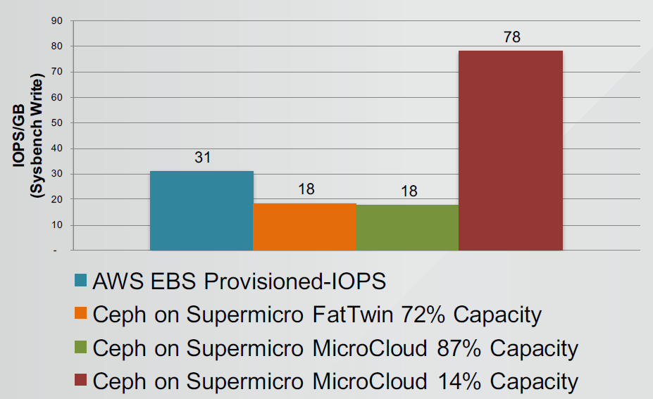
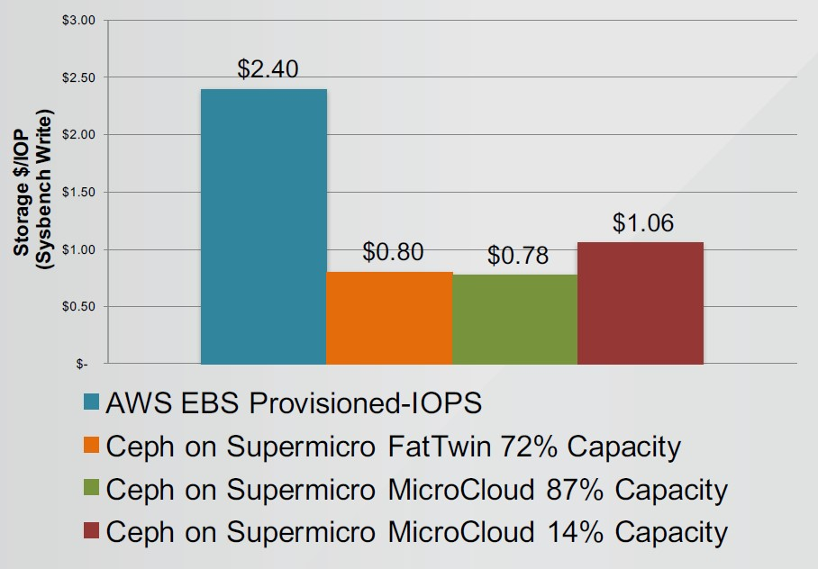

Ceph is traditionally known for both object and block storage, but not for database storage. While its scale-out design supports both high capacity and high throughput, the stereotype is that Ceph doesn’t support the low latency and high IOPS typically required by database workloads.

However, recent testing by Red Hat, Supermicro, and Percona—one of the top suppliers of MySQL database software—show that Red Hat Ceph Storage actually does a good job of supporting database storage, especially when running it on multiple VMs, and it does very well compared to running MySQL on Amazon Web Services(AWS).

In fact, Red Hat was a sponsor of [Percona Live Europe](https://www.percona.com/live/plam16/) last week in Amsterdam, and it wasn’t just to promote Red Hat Enterprise Linux. Sr. Storage Architect Karan Singh presented a session “[MySQL and Ceph: A tale of two friends](https://www.percona.com/live/plam16/sessions/mysql-and-ceph-tale-two-friends).”

_Figure 1: This shadowy figure with the stylish hat has been spotted storing MySQL databases in a lab near you._

**MySQL Needs Performance, But Not Just Performance**

The front page of the [Percona Europe web site](https://www.percona.com/live/plam16/) says “Database Performance Matters,” and so it does. But there are multiple ways to measure database performance—it’s not just about running one huge instance of MySQL on one huge bare metal server with the fastest possible flash array. (Just in case that is what you want, check out conference sponsor [Mangstor](https://mangstor.com/), who offer a very fast flash array connected using NVMe Over Fabrics.)  The majority of MySQL customers also consider other aspects of performance:

- **Performance across many instances:** Comparing aggregate performance of many instances instead of just one large MySQL instance
- **Ease of deployment:** The ability to spin up, manage, move and retire many MySQL instances using virtual machines.
- **Availability:** Making sure the database keeps running even in case of hardware failure, and can be backed up and restored in case of corruption.
- **Storage management:** Can the database storage be centralized, easily expanded, and possibly shared with other applications?
- **Price/Performance:** Evaluating the cost of each database transaction or storage IOP.
- **Private vs. Public Cloud:** Which instances should be run in a public cloud like AWS vs. in a private, on-premises cloud?

It’s common for customers to deploy many MySQL instances to support different applications, users, and projects. It’s also common to deploy them on virtual machines, which makes more efficient use of hardware and simplifies migration of instances. For example a particular MySQL instance can be given more resources when it’s hot then moved to an older server when it’s not.

Likewise it’s preferred to offer persistent, shared storage which can scale up in both capacity and performance when needed. While a straight flash array or local server flash might offer more peak performance to one MySQL instance, Ceph’s scale-out architecture makes it easy to scale up the storage performance to run many MySQL instances across many storage nodes. Persistent storage ensures the data continues to exist even if the database instances goes away. Ceph also features replication and erasure coding to protect against hardware failure and snapshots to support quick backup and restore of databases.

As for the debate between public vs. private cloud, it has too many angles to cover here, but clearly there are MySQL customers who prefer to run in their own datacenter rather than AWS, and others who would happily go either way depending which costs less.

_Figure 2: Ceph can scale out to many nodes for both redundancy and increased performance for multiple database instances._

But the questions remain: can Ceph perform well enough for a typical MySQL user, and how does it compare to AWS in performance and price? This is what Red Hat, Supermicro, and Percona set off to find out.

__

_Figure 3: MySQL on AWS vs. MySQL on Red Hat Ceph Storage. Which is faster? Which is less expensive?_

First Red Hat ran baseline benchmarks on AWS EC2 (r3.2xlarge and m4.4xlarge) using Amazon’s Elastic Block Storage (EBS) with provisioned IOPS set to 30 IOPS/GB, testing with Sysbench for 100% read and 100% write. Not surprisingly, after converting from Sysbench numbers (requests per second per MySQL instance) to IOPS, AWS performance was as advertised—30 read IOPS/GB and 26 write IOPS/GB.

Then they tested the Ceph cluster illustrated above: 5 Supermicro cloud servers (SSG-6028R-E1CF12L) with four NVMe SSDs each, plus 12 Supermicro client machines on dual 10GbE networks. Software was Red Hat Ceph Storage 1.3.2 on RHEL 7.2 with Percona Server. After running the same Sysbench tests the Ceph cluster at 14% and 87% capacity utilization, they found read IOPS/GB were 8x or 5x better, while write IOPS/GB were 3x better than AWS at 14% utilization.  At 87% utilization of the Ceph cluster, write IOPS/DB were 14% lower than AWS due to the write amplification from the combination of InnoDB write buffering, Ceph replication, and OSD journaling.

_Figure 4: Ceph private cloud generated far better write IOPS/GB at 14% capacity and slightly lower IOPS/GB at 72% and 87% capacity._

**What about Price/Performance?**

The Ceph cluster was always better than AWS for reads and much better than AWS for writes when nearly empty but slightly slower than AWS for writes when nearly full. On the other hand when looking at the cost per IOP for MySQL writes, Ceph was far less expensive than AWS in all scenarios. In the best case Ceph was less than 1/3rd the price/IOP and in the worst case half the price/IOP, vs. AWS EBS with provisioned IOPS.

_Figure 5: MySQL on a Ceph private cloud showed much better (lower) price/performance than running on AWS EBS with Provisioned IOPS._

**What Next for the Database Squid?**

Having shown good performance chops running MySQL on Red Hat Ceph Storage, Red Hat also looked at tuning Ceph block storage performance, including RBD format, RBD order, RBD fancy striping, TCP settings, and various QEMU settings. These are covered in the Red Hat Summit presentation and Percona webinar.

For the next phase in this database testing, I’d like to see Red Hat, Supermicro, and Percona test larger server configurations that use more flash per server and faster networking. While this test only used dual 10GbE networks, previous testing has shown that using Mellanox 40 or 50Gb Ethernet can reduce latency and therefore increase IOPS performance for Ceph, even when dual 10GbE networks provide enough bandwidth. It would also be great to demonstrate the benefits of Ceph replication and cluster self-healing features for data protection as well as Ceph snapshots for nearly instant backup and restore of databases.

My key takeaways from this project are as follows:

- Ceph is a good choice for many MySQL use cases
- Ceph offers excellent performance and capacity scalability, even if it might not offer the fastest performance for one specific instance.
- Ceph performance for MySQL compares favorably with AWS EBS Provisioned IOPS
- You can build a private storage cloud with Red Hat Ceph Storage with a lower price/capacity and price/performance than running on AWS.

If you’re running a lot of MySQL instances, especially on AWS, it behooves you to evaluate Ceph as a storage option. You can learn more about this from the PerconaLive and Red Hat Summit presentations linked below.

**Supporting Resources:**

- Red Hat Reference Architecture: [Deploying MySQL Databases on Red Hat Ceph Storage](https://www.redhat.com/en/resources/mysql-databases-ceph-storage-reference-architecture)
- Supermicro [solution brief for Red Hat Ceph Storage](https://www.redhat.com/cms/managed-files/st-supermicro-red-hat-ceph-storage-datasheet-en.pdf)
- Red Hat Summit 2016 presentation: [MySQL, Containers and Ceph](https://www.redhat.com/files/summit/session-assets/2016/SS42190-mysql-containers-and-ceph.pdf)
- Percona webinar recording from August 2, 2016: [MySQL and Ceph](https://www.percona.com/resources/webinars/mysql-and-ceph)
- Percona Yves Trudeau blog from July 13, 2016: [Using Ceph with MySQL](https://www.percona.com/blog/2016/07/13/using-ceph-mysql/)
- Percona Yves Trudeau blog from August 4, 2016: [Percona XtraDB Cluster on Ceph](https://www.percona.com/blog/2016/08/04/percona-xtradb-cluster-on-ceph/)
- Mellanox [ConnectX-4](http://www.mellanox.com/page/products_dyn?product_family=204&mtag=connectx_4_en_card) and [ConnectX-4 Lx](http://www.mellanox.com/page/products_dyn?product_family=219&mtag=connectx_4_lx_en_card) adapters for 10, 25, 40, 50 and 100GbE
- Mellanox Spectrum [Ethernet Switches](http://www.mellanox.com/page/products_dyn?product_family=251&mtag=sn2000)

Source: mellanox ([Ceph For Databases? Yes You Can, and Should](http://www.mellanox.com/blog/2016/10/ceph-for-databases-yes-you-can-and-should/))
