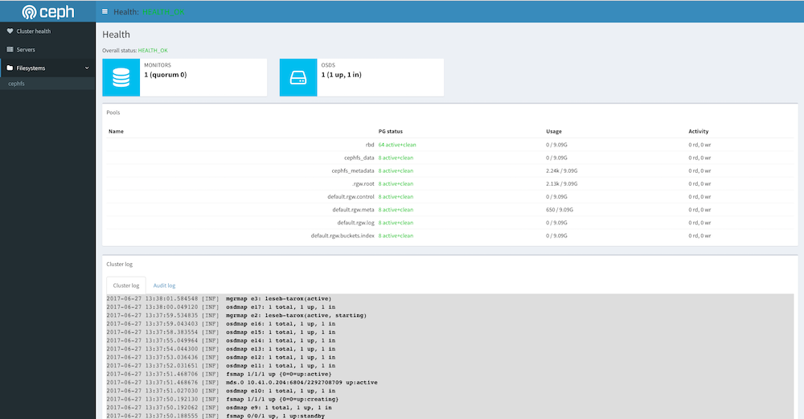

I have been recently working on refactoring our Ceph container images. We used to have two separate images for `daemon` and `demo`. Recently, for Luminous, I decided to merge the demo container into daemon. It makes everything easier, code is in a single place, we only have a single image to test with the CI and users have a single image to play with.

As reminder, this is what the container can do for you:

- Bootstrap a single Ceph monitor
- Bootstrap a single Ceph OSD with Bluestore (running on a filesystem)
- Bootstrap a single MDS server
- Bootstrap a RGW instance with optionally a user and the ability to interact with `s3cmd`.
- Bootstrap a rbd-mirror daemon
- Bootstrap a ceph-mgr daemon with its dashboard

This is how to run it:

<table><tbody><tr><td class="code"><pre>docker run -d  --name demo  -e MON_IP=0.0.0.0  -e CEPH_PUBLIC_NETWORK=0.0.0.0/0  --net=host  -v /var/lib/ceph:/var/lib/ceph  -v /etc/ceph:/etc/ceph  -e CEPH_DEMO_UID=qqq  -e CEPH_DEMO_ACCESS_KEY=qqq  -e CEPH_DEMO_SECRET_KEY=qqq  -e CEPH_DEMO_BUCKET=qqq  ceph/daemon  demo </pre></td></tr></tbody></table>

Obviously adapt both `MON_IP` and `CEPH_PUBLIC_NETWORK` with your host specificity. It’s handy to bindmount both `/var/lib/ceph` and `/etc/ceph` so the container can survive a restart.

Output example on my test system:

<table><tbody><tr><td class="code"><pre>$ sudo ceph -s   cluster:     id:     940848cd-658a-46d1-8161-4bcd37c36ce9     health: HEALTH_OK     services:     mon: 1 daemons, quorum leseb-tarox     mgr: leseb-tarox(active)     mds: 1/1/1 up {0=0=up:active}     osd: 1 osds: 1 up, 1 in     data:     pools:   8 pools, 120 pgs     objects: 216 objects, 5030 bytes     usage:   1091 MB used, 9212 MB / 10303 MB avail     pgs:     120 active+clean </pre></td></tr></tbody></table>

Obviously, this container enables the new dashboard manager:

  

> Enjoy this nice preview on Luminous, the current image from the Docker Hub is build on the first Luminous RC.

Source: Sebastian Han ([The new Ceph container demo is super dope!](https://sebastien-han.fr/blog/2017/06/27/New-Ceph-container-demo-is-super-dope/))
