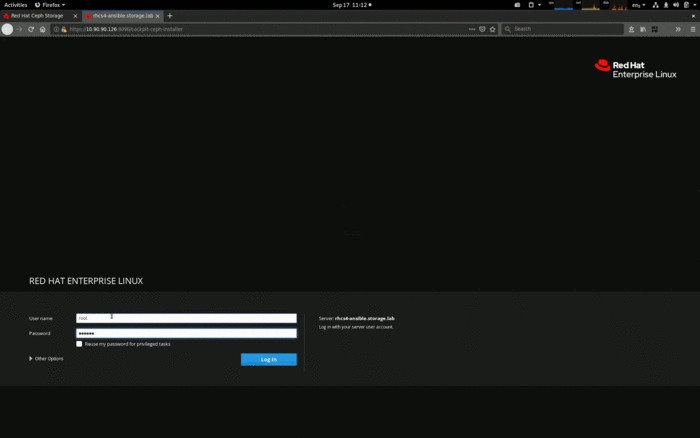
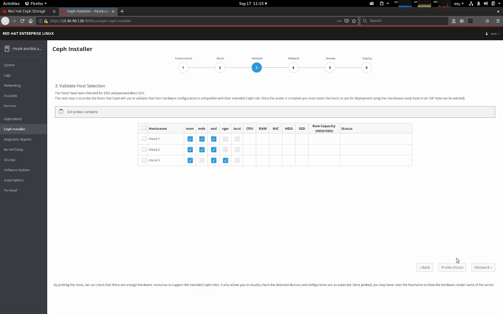

_with Paul Cuzner (Red Hat)_

\[youtube https://www.youtube.com/watch?v=SMgqHYfAWCk&w=640&h=360\]

# Lowering the bar to installing Ceph

The last few years have seen Ceph continue to mature in stability, scale and performance to become the leading open source storage platform. However, getting started with Ceph has typically involved the administrator learning automation products like Ansible first. While learning Ansible brings its own rewards, wouldn’t it be great if you could simply skip this step and just get on with learning and using Ceph?

The upcoming Red Hat Ceph Storage 4 introduces a [GUI installation tool](https://github.com/pcuzner/cockpit-ceph-installer) built on top of the [Cockpit](https://cockpit-project.org/) web console. Under the covers, we still rely on the latest iteration of the same trusted [ceph-ansible](https://github.com/ceph/ceph-ansible) installation flows that have been with us since 2016. The new install UI guides users with no prior Ceph knowledge to build clusters ready for use by providing sensible defaults and making the right choices without asking the operator for much more than a set of servers to turn into a working cluster.

# More Open, More Betas

Another change we are working on is to make our development process for the supported Red Hat Ceph Storage product more transparent to the Community. While making an enterprise-class product actually supportable involves a number of, shall we say, not too exciting processes, there is no need to be mysterious about what is that we are cooking. While Red Hat has allowed us to be delightfully open about our product plans and the roadmap for RHCS, we have also encountered some organizational timidity around public betas: there is this simmering concern in the company that somebody is somehow going to go to production with one, or that we are going to be embarrassed by a broken beta. We cannot stop folks from doing unwise things, but neither are we responsible for their actions. And on the broken beta bit… I fully expect betas to be broken on some level, so there you have it!

We released three beta builds of RHCS 4 since June, and whenever a release’s timeline permits it, we aim to follow this model in the future. This has been our most successful beta program to date, and we want to continue on this path.

Let’s dig into the details of the new installer as delivered in Beta 3.

# Cockpit Ceph Installer

The [Cockpit Ceph installer](https://github.com/pcuzner/cockpit-ceph-installer) is (rather unsurprisingly) a plug-in for the [Cockpit](https://cockpit-project.org/) web-based server management interface found in several Linux distributions, including CentOS, Fedora Server, and RHEL. The plug-in creates a simple way to deploy a Ceph cluster by consuming infrastructure provided by the [ansible-runner](https://github.com/ansible/ansible-runner) and [ansible-runner-service](https://github.com/ansible/ansible-runner-service) projects. The Cockpit Ceph Installer uses the cockpit UI to validate that the intended hosts are indeed suitable for building a Ceph cluster, and then drive the complete Ansible installation using [ceph-ansible](https://github.com/ceph/ceph-ansible).

The Red Hat Storage team is integrating the new UI Installer in the RHCS Ceph distribution, but there is nothing stopping others from joining our UX philosophy and choosing the same install approach, as the code has been released under Open Source licensing following our standard practice.

# Design Overview

Developing a GUI could have gone in many different directions, but the guiding principle has been to not reinvent the wheel. With that in mind the architecture of the installer consists of the following components;

<table><tbody><tr><td><strong>ceph-ansible</strong></td><td>The tried and tested deployment engine that underpins Red Hat Ceph Storage (RHCS) since version 2.0.</td></tr><tr><td><strong>ansible-runner-service</strong></td><td>This is a new RESTful API wrapper around the ansible-runner interface. It provides a simple programmatic interface to the Ansible engine to handle inventory, playbooks and tasks.</td></tr><tr><td><strong>Cockpit web console</strong></td><td>The cockpit web UI is available for a variety of Linux distributions and offers a solid framework for ReactJS applications.</td></tr></tbody></table>

# As Easy as 1-2-3

With your systems subscribed to the Red Hat content distribution network, the installation flow is simplicity itself:

1. Install the installation tool rpm (cockpit-ceph-installer)
2. Start the ansible-runner-service (RESTful API service)
3. Login to the cockpit web console, and start the installation!

The installer will gather your configuration requirements, and handle all ansible configuration interaction for you. The installation workflow also performs a sanity check of the servers you’ve chosen against your desired Ceph roles, before deployment begins with all detected configuration errors reported in the UI.

# The New Interface 

The animation below provides an overview of the UI steps, during the installation of RHCS4 to a small cluster of 3 host machines.

The UI supports the most commonly used ceph-ansible features, and utilizes the same configuration files that a manual deployment with ceph-ansible would use. This approach enables advanced users to tweak an installation by manually editing the configuration data, before the deployment is started.

For entry level users, UI-driven installation is a game changer, as it always provides a valid selection and simply does not allow an operator entirely new to Ceph to build an invalid cluster configuration — the install process always offers a valid option, or when not provided with enough hardware, will identify what additional resources are required to proceed.

# Exploring in Detail

However, there are a few features of the installation process that are worth exploring in more detail.

When adding hosts, the UI supports masking. This allows multiple hosts to be added within the same Add Hosts operation. The installer automatically enables the RHCS 4 dashboard feature, which also requires a host to be identified for Metrics (prometheus and grafana). You may choose a separate host for metrics, or simply use the same machine you’re running Ansible from as your metrics host.

Once the hosts are selected, the Validate Hosts page, provides a Probe button. The probe phase executes a background playbook that performs a sanity check; comparing each host’s configuration against the requirements of the Ceph roles that have been selected. Any errors, or warnings detected are shown.

During the probe process, the network topology of the hosts is gathered and compared, enabling common subnets across hosts to be categorized. Available networks subnets are then shown against the varying network roles within a Ceph cluster, allowing you to easily separate front-end (public), back-end (cluster), S3 and iSCSI networks.

# Do Try This at Home

Red Hat Ceph Storage Beta 3 is available via anonymous FTP from Red Hat’s website, linked below after a brief message from our lawyers:

**RED HAT CEPH STORAGE 4.0 BETA 3 EARLY ACCES** — **PROVIDED WITH NO SUPPORT**

**Do not upgrade a production installation to a beta release.**

**DOWNLOAD SITE: [ftp://partners.redhat.com/cea2c9e6481d3de81578640349d9b6dc](ftp://partners.redhat.com/cea2c9e6481d3de81578640349d9b6dc)**  
**PLEASE SUBMIT FEEDBACK THROUGH YOUR RED HAT CONTACT OR VIA [BUGZILLA](http://bugzilla.redhat.com)**

_Comments? Discuss on [Hacker News](https://news.ycombinator.com/item?id=21329876)._

_[Cross-posted to the Ceph Blog](https://ceph.io/community/red-hat-ceph-4-easy-peasy-installation/)._

Source: Federico Lucifredi ([Installing Ceph the Easy-Peasy Way](https://f2.svbtle.com/installing-ceph-the-easy-peasy-way))
