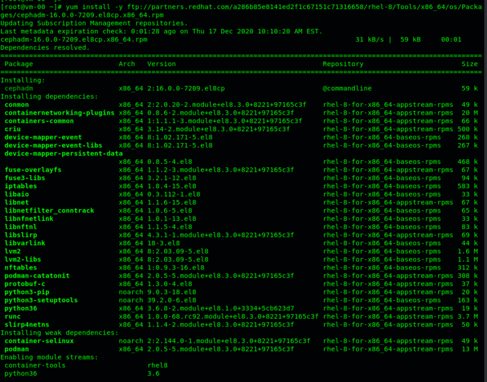
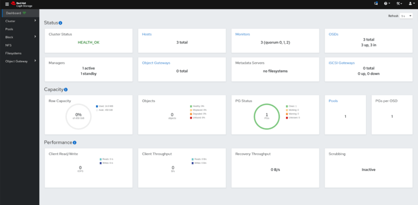

## _Highlights of Alpha 4 release include the new integrated installer_

_with Daniel Pivonka (Red Hat) and Paul Cuzner (Red Hat)_

We’re delighted to announce availability of the new Alpha 4 release of [Red Hat Ceph Storage](https://www.redhat.com/en/technologies/storage/ceph) 5, built on the upstream project’s _Pacific_ release cycle. This post is the first of a series that will walk you through the enhancements coming with the next major upgrade of Ceph Storage—  
well ahead of their production release—and give the details needed to facilitate testing with early-access releases.

Today’s post centers on the new Cephadm interface to the orchestration API, which is intended to become the preferred bare-metal installation and management method for Ceph across the broader vendor community. You can find download details for early access releases at the end of this blog. Now, without further ado, on to what is new.

[](https://svbtleusercontent.com/uRH14eA2bJqVoVRtHsVtHV0xspap.jpg)

# A short history

In the recent past, Red Hat’s Ceph distribution has been deployed and managed using the [ceph-ansible](https://github.com/ceph/ceph-ansible) playbooks. Ansible provided an easy way for operators familiar with Red Hat’s configuration tool of choice to build and configure Ceph clusters. ceph-ansible spans not only installation but also provides several “day 2” management tasks.

However, for all its flexibility, Ansible requires an understanding of its operation before you can start deploying and managing a storage cluster. Ceph technology has reached a level of maturity such that it is now both possible and timely to once again reduce the learning curve to deploying a distributed storage cluster. Ceph Storage 5 Alpha introduces a new integrated orchestration “engine,” sharing operations between [Rook](https://github.com/rook/rook) (the interface of choice in Kubernetes environments) (the interface of choice in Kubernetes environments), and Cephadm (the bare-metal install interface).

And for those of you who, like us, love to automate with Ansible, fear not: We’ve got plans for you, as well. But that’s another post for another day.

Back to the task at hand, Cephadm takes care of the same install-time operations Ceph-ansible supports but natively, from the Ceph command line interface (CLI), and will eventually integrate seamlessly with the Dashboard UI. Cephadm builds on the orchestrator API introduced starting with the Ceph Storage 4 release and runs as just another module in the Manager daemon (MGR).

This means that instead of your management tool being configured and managed outside of the Ceph cluster, installation, scale-out and upgrade are now fully integrated features that behave like any other bit of core Ceph functionality. This new architecture centralizes configuration information and makes it available to other Ceph components, enabling advanced management functionality as we have been building into the Rook operator for Kubernetes over the past two years, much as you can see in production today with [OpenShift Container Storage](https://www.redhat.com/en/technologies/cloud-computing/openshift-container-storage). You can think of Cephadm as the orchestration interface to manage a Ceph cluster when the hosting environment is not Kubernetes (where Rook would take charge instead).

# Architectural overview

Cephadm uses SSH connections to interact with hosts and deploys services using standard container images from Red Hat’s registry or a local cache. There are no dependencies on outside tools, and a cluster is built simply by downloading a binary and running a bootstrap sequence. The only dependencies are Python 3, LVM, and the Podman container runtime. In addition, because Cephadm runs inside the Manager, the tool is inherently highly available.

In short, Cephadm is the easiest way yet to get a new Ceph cluster up and running quickly. The bootstrap sequence is started from the command line on the first host of the cluster. Running the Cephadm script in “bootstrap mode” will set up a minimal cluster (one monitor and manager daemon) on the local host in minutes. From that point on, other operations, such as adding more hosts or storage, will take place through the Ceph CLI. Watch us build a working Ceph cluster in less than three minutes:

# The gory details

We are including here detailed step-by step instructions especially aimed at those among you who want to try their hand with the new tool in Alpha 4.

**Pre-bootstrap checks**. Everything we do in RHCS 5 is container based, so you’ll need a Red Hat account to access them (don’t panic if you don’t already have an account: just head over to the [Customer Portal](https://www.redhat.com/wapps/ugc/register.html) and create one!). With your account in place, the next thing is ensuring that package dependencies are met —you just need to ensure that python3, lvm2, and the podman package are installed.

Finally, your host will need a hostname defined - if you’re still staring at a hostname of `localhost.localdomain`, the `hostnamectl set-hostname` command is your friend.

**Download the Cephadm ‘binary’**. The binary is a python script that Cephadm uses to bootstrap a cluster, but the mgr/cephadm module also uses this binary to deploy services on hosts by piping it through an SSH connection.

```
yum install -y ftp://partners.redhat.com/a286b85e8141ed2f1c67151c71316658/rhel-8/Tools/x86_64/os/Packages/cephadm-16.0.0-7209.el8cp.x86_64.rpm
```

[](https://svbtleusercontent.com/71JWVyWNGtFhcaDABEYnSq0xspap.png)

**Bootstrapping**. The bootstrap process establishes a single node Ceph cluster and supports various options to tailor its security, monitoring and management. To see which options are available, use the `cephadm bootstrap -h` command.

In this example we’ll rely on the defaults, which will:

- enable the management UI
- install the monitoring and alerting stack
- pull container images from the Red Hat container registry

```
cephadm bootstrap --mon-ip <ip-of-host> --registry-url registry.redhat.io --registry-username
<your-rh-account-name> --registry-password <your-rh-password> --allow-fqdn-hostname
```

Building a cluster with Cephadm starts with the bootstrap process:

Upon successful completion, the bootstrap process provides a username and password to access the Ceph Dashboard user interface, as well as a command to run to access the Ceph CLI. With these, the user can connect to the Cephadm CLI interface to inspect a running cluster:

Once the bootstrap is completed, a minimal cluster is now up and running. A single MON and MGR instance and the monitoring stack used by the Dashboard are now running in containers on the host. All Ceph CLI interaction now happens within Cephadm’s ‘shell’ mode. To provide the flexibility needed when managing multiple Ceph clusters, the ‘shell’ sub-command supports numerous parameters to determine which Ceph cluster to connect to, but if the cluster is local to the shell, you need no parameters!

Now try out the interface: for example `ceph orch ps` shows all the running containers in the cluster. The orchestrator and cephadm modules support a number of new configuration and management commands, which can be viewed with `ceph orch -h` and `ceph cephadm -h`.

**Copy the SSH keys.** The bootstrap process created the SSH key pair that Cephadm uses to communicate with hosts and placed the public key (ceph.pub) in `/etc/ceph`. It also added it to the local host’s `authorized_keys` and it needs to be copied to the other hosts that will be part of the cluster. The next example shows the public key being copied to other hosts using the `ssh-copy-id` command.

**Add hosts.** Once the key has been copied to other hosts they can be added to the cluster with this command in the Ceph shell: `ceph orch host add <hostname>`

**Add OSDs.** Adding storage daemons (OSD, for object storage daemon) is easy too. Here we have chosen to add all available devices in the cluster, but an operator can create an OSD service specification to retain more control over what disks drives are to be used as OSDs by Ceph. The service specification is described [here](https://docs.ceph.com/en/latest/cephadm/drivegroups/).

**Open the Dashboard.** The Ceph Dashboard has been up and running since the bootstrap completed (the login credentials were shown at the end of the bootstrap process).

[](https://svbtleusercontent.com/qnyoyT8LZGhvpB5hCzjpKM0xspap.png)

With a healthy running cluster, the Cephadm interface can be used to deploy storage protocol services as needed, including the filesystem metadata daemon (MDS) used by CephFS, or the S3 storage gateway (RGW). Try it yourself by adding an RGW instance to the cluster you just built with `ceph orch apply rgw test_realm test_zone`.

Cephadm is under active development, so you should assume its final state may vary somewhat from the preview we’re covering now.. Learn more about what else it can already do in the [upstream documentation](https://docs.ceph.com/en/latest/cephadm/install/) of the Ceph project.

# Do try this at home

Red Hat Ceph Storage 5 Alpha 4 is available via anonymous FTP from Red Hat’s website, linked below after a brief message from our lawyers:

**RED HAT CEPH STORAGE 5.0 ALPHA 4 EARLY ACCESS** — **PROVIDED WITH NO SUPPORT**

**Do not upgrade a production installation to an early access release.**

**DOWNLOAD SITE: [ftp://partners.redhat.com/d960e6f2052ade028fa16dfc24a827f5](ftp://partners.redhat.com/d960e6f2052ade028fa16dfc24a827f5)**  
**CONTAINER IMAGE: [https://access.redhat.com/containers-r6/#/search/ceph-5](https://access.redhat.com/containers-r6/#/search/ceph-5)**  
**PLEASE SUBMIT FEEDBACK THROUGH YOUR RED HAT CONTACT OR VIA [BUGZILLA](http://bugzilla.redhat.com)**

_Comments? Discuss on [Hacker News](https://news.ycombinator.com/item?id=25520747)._

_[Cross-posted to the Red Hat Blog](https://www.redhat.com/en/blog/red-hat-ceph-storage-5-introducing-cephadm)._

Source: Federico Lucifredi ([RHCS 5: Introducing Cephadm](https://f2.svbtle.com/introducing-cephadm))
