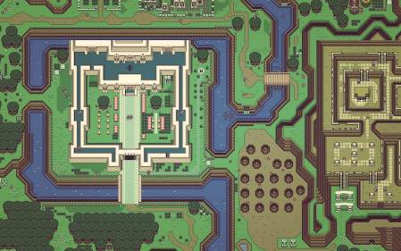

Getting more familiar with the Ceph CLI with CRUSH.

  

For the purpose of this exercise, I am going to:

- Setup two new racks in my existing infrastructure
- Simply add my current server in them
- Create a new CRUSH rule that uses both racks

  

Let's start by creating two new racks:

`bash $ ceph osd crush add-bucket rack1 rack added bucket rack1 type rack to crush map $ ceph osd crush add-bucket rack2 rack added bucket rack2 type rack to crush map`

As you can see racks are empty (and this normal):

\`\`\`bash $ ceph osd tree

# id weight type name up/down reweight

\-6 0 rack rack2 -5 0 rack rack1 -1 11.73 root default -2 5.46 host test1 0 1.82 osd.0 up 1 1 1.82 osd.1 up 1 -3 5.46 host test2 2 1.82 osd.2 up 1 3 1.82 osd.3 up 1 \`\`\`

Now we assign each host to a specific rack:

\`\`\`bash $ ceph osd crush move test1 rack=rack1 moved item id -2 name 'test1' to location {rack=rack1} in crush map

$ ceph osd crush move test2 rack=rack2 moved item id -3 name 'test2' to location {rack=rack1} in crush map \`\`\`

We move both racks into the default root:

`bash $ ceph osd crush move rack2 root=default moved item id -6 name 'rack2' to location {root=default} in crush map $ ceph osd crush move rack1 root=default moved item id -5 name 'rack1' to location {root=default} in crush map`

Check the final result:

\`\`\`bash $ ceph osd tree

# id weight type name up/down reweight

\-1 11.73 root default -6 0.81 rack rack2 2 1.82 osd.2 up 1 3 1.82 osd.3 up 1 -5 10.92 rack rack1 -2 5.46 host os-ci-test10 0 1.82 osd.0 up 1 1 1.82 osd.1 up 1 \`\`\`

Eventually create a new rule for this placement:

`bash $ ceph osd crush rule create-simple racky default rack`

```
{ "rule_id": 3,
  "rule_name": "racky",
  "ruleset": 3,
  "type": 1,
  "min_size": 1,
  "max_size": 10,
  "steps": [
        { "op": "take",
          "item": -1},
        { "op": "chooseleaf_firstn",
          "num": 0,
          "type": "rack"},
        { "op": "emit"}]}]
```

Finally, you can assign a pool to this ruleset:

`bash $ ceph osd pool set rbd crush_ruleset 3 set pool 2 crush_ruleset to 3`

  

> Ceph's CLI is getting more and more powerful. It is good to see that we don't need to download the CRUSH map, then edit it manually and eventually re-commit it :).
