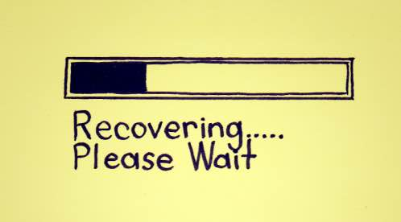

Many years ago I came across a script made by Shawn Moore and Rodney Rymer from Catawba university. The purpose of this tool is to reconstruct a RBD image. Imagine your cluster dead, all the monitors got wiped off and you don't have backup (I know what can possibly happen?). However all your objects remain intact.

I've always wanted to blog about this tool, simply to advocate it and make sure that people can use it. Hopefully it will be a good publicity for this tool :-).

## Backuping RBD images

Before we dive into the recovery process. I'd like to take a few lines to describe what is important to backup and how to backup it.

- Keep track of all the images across all the pools
- Store their properties (shown by `rbd info <pool>/<image>`)
- Store the RBD headers

## Recover

In the context of this exercise I will simply:

- Create a RBD image
- Map it on a machine
- Put a XFS filesystem on top of it
- Touch a simple file

\`\`\`bash $ rbd create -s 10240 leseb $ rbd info leseb rbd image 'leseb': size 10240 MB in 2560 objects order 22 (4096 kB objects) block\_name\_prefix: rb.0.1066.74b0dc51 format: 1

$ sudo rbd -p rbd map leseb /dev/rbd0

$ sudo rbd showmapped id pool image snap device 0 rbd leseb - /dev/rbd0

$ sudo mkfs.xfs /dev/rbd0 log stripe unit (4194304 bytes) is too large (maximum is 256KiB) log stripe unit adjusted to 32KiB meta-data=/dev/rbd0 isize=256 agcount=17, agsize=162816 blks

```
     =                       sectsz=512   attr=2, projid32bit=0
```

data = bsize=4096 blocks=2621440, imaxpct=25

```
     =                       sunit=1024   swidth=1024 blks
```

naming =version 2 bsize=4096 ascii-ci=0 log =internal log bsize=4096 blocks=2560, version=2

```
     =                       sectsz=512   sunit=8 blks, lazy-count=1
```

realtime =none extsz=4096 blocks=0, rtextents=0

$ sudo mount /dev/rbd0 /mnt $ echo "foo" > /mnt/bar $ sudo umount /mnt $ sudo rbd unmap /dev/rbd0 \`\`\`

Prepare a directory on a server to restore your image:

`bash $ mkdir recover_leseb $ wget -O rbd_restore https://raw.githubusercontent.com/smmoore/ceph/master/rbd_restore.sh $ chmox +x rbd_restore`

Then I need to collect all the RBD object files, on my setup I only had one OSD server, which made the gathering operation easier:

`bash $ cd recover_leseb ~/recover_leseb$ for block in $(find /var/lib/ceph/osd/ -type f -name rb.0.1066.74b0dc51.*); do cp $block . ; done ~/recover_leseb$ bash recover.sh leseb rb.0.1066.74b0dc51 10737418240 ~/recover_leseb$ file leseb leseb: SGI XFS filesystem data (blksz 4096, inosz 256, v2 dirs) ~/recover_leseb$ du -h leseb 11M leseb`

Hum looks like we have something interesting here :) Let's see if it really worked:

\`\`\`bash ~/recover\_leseb$ losetup -f /dev/loop0

~/recover\_leseb$ losetup /dev/loop0 leseb ~/recover\_leseb$ mount /dev/loop0 /mnt/ ~/recover\_leseb$ df -h /mnt Filesystem Size Used Avail Use% Mounted on /dev/loop0 10G 33M 10G 1% /mnt

~/recover\_leseb$ ls /mnt/ bar ~/recover\_leseb$ cat /mnt/bar foo \`\`\`

  

> **HELL YEAH!**
