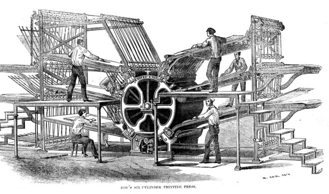

I am happy to announce our latest Hammer release of Red Hat Ceph Storage, minor release 3 — also known as 1.3.3. This release rebases to the latest upstream 0.94.9, and we are quite proud to say we accomplished this in just 30 days, combining quality and speedy delivery in one swift, tentacular package. Our newest release is immediately available, both ISOs and repositories, for either [RHEL 7.2](https://rhn.redhat.com/errata/RHSA-2016-1972.html) or [Ubuntu 14.04](https://rhn.redhat.com/errata/RHSA-2016-1973.html).

This release resolves [62 bugs](https://bugzilla.redhat.com/buglist.cgi?bug_status=NEW&bug_status=ASSIGNED&bug_status=POST&bug_status=MODIFIED&bug_status=ON_DEV&bug_status=ON_QA&bug_status=VERIFIED&bug_status=RELEASE_PENDING&bug_status=CLOSED&list_id=5967720&product=Red%20Hat%20Ceph%20Storage&query_format=advanced&resolution=---&resolution=ERRATA&target_release=1.3.3) and known issues, and solidifies 1.3 as “old reliable” in our supported release lineup. While 1.3 is barely 15 months old and not even halfway through its lifecycle, in the fast-moving world of Software-Defined-Storage the state of the art is now defined by the new shiny RHCS 2 we shipped just four weeks ago — If you are new to Ceph, I recommend you start there or with upstream Jewel.

# What’s new

First of all, we have a moderate severity security fix ([CVE-2016-7031](https://access.redhat.com/security/cve/CVE-2016-7031)), just to make sure we have your attention. Then, if you are, shall we say, detail-oriented, I recommend the full [release notes](https://access.redhat.com/documentation/en/red-hat-ceph-storage/1.3.3/single/release-notes/) — they make for some compelling bedtime reading ;-)

# One More Thing

In Steve’s proud tradition, I have saved the best for last. We are announcing today a new reference architecture with our partners at Percona and Supermicro. This reference architecture details an entirely new use case for Ceph: hosting of [MySQL databases on Ceph RBD](https://www.redhat.com/en/resources/mysql-databases-ceph-storage-reference-architecture). Alongside our existing use cases for OpenStack block storage, where we have been consistently [leading the market](https://www.openstack.org/assets/survey/April-2016-User-Survey-Report.pdf) since the OpenStack foundation has been tallying users, and AWS S3-compatible Object Storage, where we believe we may be supplying the most compatible solution on the market, this is our next logical step in the march to Ceph’s long term vision of a single storage cluster supporting all needs of the enterprise customer. Identifying capable and reliable cloud storage that can provide the required performance and latency is essential to bringing Cloud Storage to the database world, and we are delivering a complete hardware and software stack with our two partners to make that happen.

# We’re Always Ready to Support You

As you may already know, Red Hat Ceph Storage 1.3 is the first Ceph release delivered with a 36 month support [lifecycle](https://access.redhat.com/articles/1372203), reaching all the way to June 30, 2018. As always, if you need technical assistance, our Global Support team is but one click away using the Red Hat support portal.

Source: Federico Lucifredi ([It's Hammer Time](http://f2.svbtle.com/its-hammer-time))
